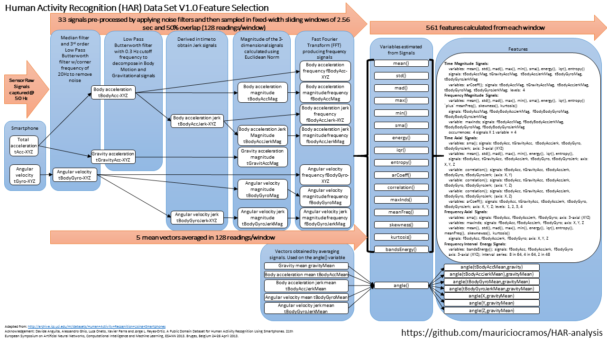

CodeBook
================
by Maurício Collaça
on 2017-02-01

This code book modifies and updates the available codebooks with the data to indicate all variables and summaries calculated, units, transformations, work performed to clean up, tidy, process and display of the data and any other relevant information.

Data set source
---------------

The data set used in this project is from the University of California Irvine (UCI) Machine Learning Repository: Human Activity Recognition Using Smartphones Data Set Version 1.0. The data set represents data collected from 30 subjects performing activities of daily living (ADL) while carrying a waist-mounted Samsung Galaxy S smartphone with embedded accelerometer and gyroscope inertial sensors. The original documentation is available [here](http://archive.ics.uci.edu/ml/datasets/Human+Activity+Recognition+Using+Smartphones).

The data set for this project is available at [Cloudfront](https://d396qusza40orc.cloudfront.net/getdata%2Fprojectfiles%2FUCI%20HAR%20Dataset.zip) or [UCI](http://archive.ics.uci.edu/ml/machine-learning-databases/00240/UCI%20HAR%20Dataset.zip).

Data set description
--------------------

Abstract: Human Activity Recognition database built from the recordings of 30 subjects performing activities of daily living (ADL) while carrying a waist-mounted smartphone with embedded inertial sensors.

Data Set Characteristics: Multivariate, Time-Series
Number of Instances: 10299
Number of Attributes: 561
Associated Tasks: Classification, Clustering
Missing Values? N/A

Data Set information
--------------------

The experiments have been carried out with a group of 30 volunteers within an age bracket of 19-48 years. Each person performed six activities (WALKING, WALKING\_UPSTAIRS, WALKING\_DOWNSTAIRS, SITTING, STANDING, LAYING) wearing a smartphone (Samsung Galaxy S II) on the waist. Using its embedded accelerometer and gyroscope, There were captured 3-axial linear acceleration and 3-axial angular velocity at a constant rate of 50Hz (50 captures/second). The experiments have been video-recorded to label the data manually. The obtained dataset has been randomly partitioned into two sets, where 70% (21 volunteers) was selected for generating the training data and 30% (9 volunteers) for the test data.

The sensor signals (accelerometer and gyroscope) were pre-processed by applying noise filters and then sampled in fixed-width sliding windows of 2.56 sec and 50% overlap (128 readings/window). The sensor acceleration signal, which has gravitational and body motion components, was separated using a Butterworth low-pass filter into body acceleration and gravity. The gravitational force is assumed to have only low frequency components, therefore a filter with 0.3 Hz cutoff frequency was used. From each window, a vector of 561 features was obtained by calculating variables from the time and frequency domains.

A video of the experiment including an example of the 6 recorded activities with one of the participants can be seen [here](http://www.youtube.com/watch?v=XOEN9W05_4A).

Attribute Information
---------------------

For each record in the dataset it is provided:

-   Triaxial acceleration from the accelerometer (total acceleration) and the estimated body acceleration.
-   Triaxial Angular velocity from the gyroscope.
-   A 561-feature vector with time and frequency domain variables.
-   Its activity label.
-   An identifier of the subject who carried out the experiment.

Notes
-----

-   Features are normalized and bounded within \[-1,1\].
-   Each feature vector is a row on the text file.
-   The accelerometer units used for the acceleration signals (total and body) are 'g's (gravity of Earth -&gt; 9.80665 m/seg2).
-   The gyroscope units are radians/second.

Data set files
--------------

### For the overall data set it is provided:

`features_info.txt` - Information about the signals and calculus used to estimate variables of the feature vector.
`features.txt` - List of the 516 feature identifiers and names.
`activity_labels.txt` - List of the 6 activity identifiers and names

### For both partitions of the data set (trainning and test sets) it is provided:

561-feature vector with time and frequency domain variables for each window sample.

`train/X_train.txt`
`test/X_test.txt`

Activity identifiers for each window sample.

`train/y_train.txt`
`test/y_test.txt`

Identifiers of the subjects who carried out the experiment. Each row identifies the subject who performed the activity for each window sample. Its range is from 1 to 30.

`train/subject_train.txt`
`test/subject_test.txt`

Acceleration signal (total acceleration) from the smartphone accelerometer for the X, Y and Z axis in standard gravity units 'g'. Each row is a window sample with a 128 element vector.

`train/Inertial Signals/total_acc_x_train.txt`
`train/Inertial Signals/total_acc_y_train.txt`
`train/Inertial Signals/total_acc_z_train.txt`
`test/Inertial Signals/total_acc_x_test.txt`
`test/Inertial Signals/total_acc_y_test.txt`
`test/Inertial Signals/total_acc_z_test.txt`

Estimated body acceleration from the acellerometer obtained by subtracting the gravity from the total acceleration for the X, Y and Z axis. Each row is a window sample with a 128 element vector.

`train/Inertial Signals/body_acc_x_train.txt`
`train/Inertial Signals/body_acc_y_train.txt`
`train/Inertial Signals/body_acc_z_train.txt`
`test/Inertial Signals/body_acc_x_test.txt`
`test/Inertial Signals/body_acc_y_test.txt`
`test/Inertial Signals/body_acc_z_test.txt`

Angular velocity measured by the smartphone gyroscope for the X, Y and Z axis in radians/second units. Each row is a window sample with a 128 element vector.

`train/Inertial Signals/body_gyro_x_train.txt`
`train/Inertial Signals/body_gyro_y_train.txt`
`train/Inertial Signals/body_gyro_z_train.txt`
`test/Inertial Signals/body_gyro_x_test.txt`
`test/Inertial Signals/body_gyro_y_test.txt`
`test/Inertial Signals/body_gyro_z_test.txt`

Feature Selection
-----------------

The features selected for this data set come from the accelerometer and gyroscope 3-axial raw signals `tAcc-XYZ` (total acceleration) and `tGyro-XYZ` (angular velocity). These time domain signals (prefix `t` to denote time) were captured at a constant rate of 50 Hz (50 captures/second). Then they were filtered using a median filter and a 3rd order low pass Butterworth filter with a corner frequency of 20 Hz to remove noise. Similarly, the acceleration signal was then separated into body acceleration signal `tBodyAcc-XYZ` and gravity acceleration signal `tGravityAcc-XYZ` using another low pass Butterworth filter with a corner frequency of 0.3 Hz.

Subsequently, the body linear acceleration `tBodyAcc-XYZ` and angular velocity `tGyro-XYZ` were derived in time to obtain Jerk signals `tBodyAccJerk-XYZ` and `tBodyGyroJerk-XYZ`. Also the magnitude of these three-dimensional signals were calculated using the Euclidean norm: `tBodyAccMag`, `tGravityAccMag`, `tBodyAccJerkMag`, `tBodyGyroMag`, `tBodyGyroJerkMag`.

Finally a Fast Fourier Transform (FFT) was applied to some of these time domain signals producing frequency domain signals (prefix `f` to denote frequency): `fBodyAcc-XYZ`, `fBodyAccJerk-XYZ`, `fBodyGyro-XYZ`, `fBodyAccJerkMag`, `fBodyGyroMag`, `fBodyGyroJerkMag`.

One can conclude there are eight 3-axial signals and nine magnitude signals totalling 33 signals. These overall 33 signals were used to estimate variables of the feature vector for each pattern.

`-XYZ` is used to denote 3-axial signals in the `X`, `Y` and `Z` directions.

`tBodyAcc-XYZ`
`tGravityAcc-XYZ`
`tBodyAccJerk-XYZ`
`tBodyGyro-XYZ`
`tBodyGyroJerk-XYZ`
`fBodyAcc-XYZ`
`fBodyAccJerk-XYZ`
`fBodyGyro-XYZ`

`Mag` is used to denote magnitude signals.

`tBodyAccMag`
`tGravityAccMag`
`tBodyAccJerkMag`
`tBodyGyroMag`
`tBodyGyroJerkMag`
`fBodyAccMag`
`fBodyAccJerkMag`
`fBodyGyroMag`
`fBodyGyroJerkMag`

The following chart illustrates the feature selection. Click [here](https://github.com/mauriciocramos/HAR-analysis/raw/master/HAR-feature-selection.png) to enlarge.



### Feature variables (calculus)

There are seventeen (17) variables (calculus) that were estimated from these signals:

    ##  [1] "mean(): Mean value"                                                                         
    ##  [2] "std(): Standard deviation"                                                                  
    ##  [3] "mad(): Median absolute deviation"                                                           
    ##  [4] "max(): Largest value in array"                                                              
    ##  [5] "min(): Smallest value in array"                                                             
    ##  [6] "sma(): Signal magnitude area"                                                               
    ##  [7] "energy(): Energy measure. Sum of the squares divided by the number of values."              
    ##  [8] "iqr(): Interquartile range"                                                                 
    ##  [9] "entropy(): Signal entropy"                                                                  
    ## [10] "arCoeff(): Autorregresion coefficients with Burg order equal to 4"                          
    ## [11] "correlation(): correlation coefficient between two signals"                                 
    ## [12] "maxInds(): index of the frequency component with largest magnitude"                         
    ## [13] "meanFreq(): Weighted average of the frequency components to obtain a mean frequency"        
    ## [14] "skewness(): skewness of the frequency domain signal"                                        
    ## [15] "kurtosis(): kurtosis of the frequency domain signal"                                        
    ## [16] "bandsEnergy(): Energy of a frequency interval within the 64 bins of the FFT of each window."
    ## [17] "angle(): Angle between to vectors."

### Vectors for angle calculus

Additional vectors obtained by averaging the signals in a signal window sample. These are used on the angle() variable.

``` r
angleVectors <- read_angleVectors()
angleVectors
```

    ##                name
    ## 1       gravityMean
    ## 2      tBodyAccMean
    ## 3  tBodyAccJerkMean
    ## 4     tBodyGyroMean
    ## 5 tBodyGyroJerkMean

Variables and summaries calculated
----------------------------------

Following the project requirements:

> 1 - Merges the training and the test sets to create one data set.

The data.frame object `dataset` is created and contains the merging of the training sets (`X_train.txt`, `y_train.txt`, `subject_train.txt`) and test tests (`X_test.txt`, `y_test.txt`, `subject_test.txt`)

> 2 - Extracts only the measurements on the mean and standard deviation for each measurement.

The data.frame object `features` contains the `features.txt`

The data.frame object `dataset` is subsetted based on the column `dataset$feature` whose identifier values match the column `features$id` whose `feature$name` contains substrings `"mean()"`, `"meanFreq()"` and `"std()"`.

> 3 - Uses descriptive activity names to name the activities in the data set

The data.frame object `activity_labels` contains the `activity_labels.txt`

The data.frame object `dataset` is mutated by replacing the activity identifier value in the column `dataset$activity` by the activity name value from the column `activity_labels$name`.

> 4 - Appropriately labels the data set with descriptive variable names.

The data.frame object `dataset` is mutated by replacing the feature identifier value in the column `dataset$feature` by the feature name value from the column `features$name`.

> 5 - From the data set in step 4, creates a second, independent tidy data set with the average of each variable for each activity and each subject.

The data.frame object `averages` is created by grouping the columns `subject`, `activity` and `feature` from the data.frame `dataset` and calculating the mean of the column `dataset$value` in the column `averages$average`

General information about the environment used
----------------------------------------------

Hardware:

    Processor: Inter(R) Core(TM) i5-2300 CPU @ 2.80Ghz
    Number of Cores: 4
    Installed RAM: 8.00 GB  
    System type: x64-based processor

Operating System:

``` r
Sys.info()[c("sysname","release")]
```

    ##   sysname   release 
    ## "Windows"  "10 x64"

R version:

``` r
R.Version()[c("version.string", "arch")]
```

    ## $version.string
    ## [1] "R version 3.3.2 (2016-10-31)"
    ## 
    ## $arch
    ## [1] "x86_64"

RStudio Desktop version 1.0.136

R packages used beyond the R defaults `{base}`, `{utils}`, `{stat}`:

``` r
packageVersion("dplyr")
```

    ## [1] '0.5.0'

``` r
packageVersion("tidyr")
```

    ## [1] '0.6.1'

With this hardware and software configuration, the `run_analysis.R` takes around 55 seconds to complete at the first time, because it also includes the downloading and uncompressing tasks. That time also depends on the internet connection to the <https://d396qusza40orc.cloudfront.net/getdata%2Fprojectfiles%2FUCI%20HAR%20Dataset.zip> at running time.

``` r
unlink("Dataset.zip")
unlink("UCI HAR Dataset", recursive = TRUE, force = TRUE)
system.time({
    sink(file = "run_analysis.log")
    suppressMessages(source("run_analysis.R"))
    sink()
})
```

    ##    user  system elapsed 
    ##   17.17    2.11   51.09

In the next times you run it, there won't be any download and uncompressing tasks and it would take around 14 seconds.

``` r
system.time({
    sink(file = "run_analysis.log")
    suppressMessages(source("run_analysis.R"))
    sink()
})
```

    ##    user  system elapsed 
    ##   13.10    0.41   13.51

Installation, running and evaluation instructions
-------------------------------------------------

1.  If you still haven't done it, install R available at [The R Foundation](https://www.r-project.org/). This project used R version 3.3.2 (2016-10-31).
2.  Optionally, you may use RStudio as well, available at [RStudio](https://www.rstudio.com/). This project used RStudio Desktop version 1.0.136.
3.  If you still haven't done it, install additional R packages `{dplyr}` and `{tidyr}`. The easiest way to do that is via R (menu Packages &gt; Install Package(s)...) or RStudio (menu Tools &gt; Install packages...). This project used `{dplyr}` version 0.5.0 and `{tidr}` version 0.6.1.
4.  Download only [run\_analysis.R](https://raw.githubusercontent.com/mauriciocramos/HAR-analysis/master/run_analysis.R) and [HAR-utils.R](https://raw.githubusercontent.com/mauriciocramos/HAR-analysis/master/HAR-utils.R) in some local working directory of your preference. The other files (i.e. \*.md files) are not necessary to download for your evaluation as they are rendered by GitHub website. If you download them you would need Rstudio to view/render them in your computer.
5.  Optionally, download the `Dataset.zip` from [Cloudfront](https://d396qusza40orc.cloudfront.net/getdata%2Fprojectfiles%2FUCI%20HAR%20Dataset.zip) or [UCI](http://archive.ics.uci.edu/ml/machine-learning-databases/00240/UCI%20HAR%20Dataset.zip) in the same local working directory but the script will do that for your convenience.
6.  Open `R` or `RStudio`
7.  Go to the directory where the scripts were download using the command `setwd("your-directory-here")`
8.  Run the command: `source("run_analysis.R")`. At this point the script will download the `Dataset.zip` if necessary, uncompress it, start the data processing and display the results.

The script will display a series of messages and summary results for each project requirement in the R/Rstudio Console, easying your evaluation:

``` r
source("run_analysis.R")
```

    ## 1. Merges the training and the test sets to create one data set.

    ## 'data.frame':    5777739 obs. of  4 variables:
    ##  $ subject : int  1 1 1 1 1 1 1 1 1 1 ...
    ##  $ activity: int  5 5 5 5 5 5 5 5 5 5 ...
    ##  $ feature : int  1 1 1 1 1 1 1 1 1 1 ...
    ##  $ value   : num  0.289 0.278 0.28 0.279 0.277 ...

    ## 2. Extracts only the measurements on the mean and standard deviation for each measurement.

    ## 'data.frame':    813621 obs. of  4 variables:
    ##  $ subject : int  1 1 1 1 1 1 1 1 1 1 ...
    ##  $ activity: int  5 5 5 5 5 5 5 5 5 5 ...
    ##  $ feature : int  1 1 1 1 1 1 1 1 1 1 ...
    ##  $ value   : num  0.289 0.278 0.28 0.279 0.277 ...

    ## 3. Uses descriptive activity names to name the activities in the data set

    ## 'data.frame':    813621 obs. of  4 variables:
    ##  $ subject : int  1 1 1 1 1 1 1 1 1 1 ...
    ##  $ activity: chr  "STANDING" "STANDING" "STANDING" "STANDING" ...
    ##  $ feature : int  1 1 1 1 1 1 1 1 1 1 ...
    ##  $ value   : num  0.289 0.278 0.28 0.279 0.277 ...

    ## 4. Appropriately labels the data set with descriptive variable names.

    ## 'data.frame':    813621 obs. of  4 variables:
    ##  $ subject : int  1 1 1 1 1 1 1 1 1 1 ...
    ##  $ activity: chr  "STANDING" "STANDING" "STANDING" "STANDING" ...
    ##  $ feature : chr  "tBodyAcc-mean()-X" "tBodyAcc-mean()-X" "tBodyAcc-mean()-X" "tBodyAcc-mean()-X" ...
    ##  $ value   : num  0.289 0.278 0.28 0.279 0.277 ...

    ## 5. From the data set in step 4, creates a second, independent tidy data set with the average of each variable for each activity and each subject.

    ## 'data.frame':    14220 obs. of  4 variables:
    ##  $ subject : int  1 1 1 1 1 1 1 1 1 1 ...
    ##  $ activity: chr  "LAYING" "LAYING" "LAYING" "LAYING" ...
    ##  $ feature : chr  "fBodyAcc-mean()-X" "fBodyAcc-mean()-Y" "fBodyAcc-mean()-Z" "fBodyAcc-meanFreq()-X" ...
    ##  $ average : num  -0.9391 -0.8671 -0.8827 -0.1588 0.0975 ...

In the last requirement, the final data set `averages` is summarized in the Console, its content is saved in the file `averages.txt` on your local working directory and also opened in detail in window `View()` for your convenience by the script itself.

You may check out this data set by in many ways:

`print(averages)`
`View(averages)`
`browseURL("averages.txt")`
`View(read.table("averages.txt", header = TRUE, stringsAsFactors = FALSE))`

If you still haven't run the script, you may preview the `averages.txt` [here](https://github.com/mauriciocramos/HAR-analysis/blob/master/averages.txt).

Transformations
---------------

The [`run_analysis.R`](https://github.com/mauriciocramos/HAR-analysis/blob/master/run_analysis.R) script was developed to fullfill the following formal requirements of the project:

> 1.  Merges the training and the test sets to create one data set.
> 2.  Extracts only the measurements on the mean and standard deviation for each measurement.
> 3.  Uses descriptive activity names to name the activities in the data set
> 4.  Appropriately labels the data set with descriptive variable names.
> 5.  From the data set in step 4, creates a second, independent tidy data set with the average of each variable for each activity and each subject.

Before explaining the solutions developed for the requirements 1 through 5, first it's explained the additional R packages used and the loading of the HAR data set files which consists of multiple directories and files.

The `{dplyr}` functions `group_by()` and `summarize()` are used with the function `mean() {base}` to fast and easily calculate the average of all values grouped by `subject`, `activity` and `variable`. It's also used the `{dplyr}` chain operator `"%>%"` to improve the code readability.

``` r
library(dplyr)
```

The `{tidyr}` function `gather()` is used to take multiple columns and collapses into key-value pairs, duplicating all other columns as needed.

``` r
library(tidyr)
```

As mentioned above, in order to encapsulate code and improve the reusability and the readability of the [`run_analysis.R`](https://github.com/mauriciocramos/HAR-analysis/blob/master/run_analysis.R) script, the file reading helper functions were written in a separate R script called [HAR-utils.R](https://github.com/mauriciocramos/HAR-analysis/blob/master/HAR-utils.R).

In case you forgot to download the [HAR-utils.R](https://raw.githubusercontent.com/mauriciocramos/HAR-analysis/master/HAR-utils.R), the [run\_analysis.R](https://raw.githubusercontent.com/mauriciocramos/HAR-analysis/master/run_analysis.R) will automatically download it for your convenience.

``` r
if(!file.exists("HAR-utils.R"))
    download.file("https://raw.githubusercontent.com/mauriciocramos/HAR-analysis/master/HAR-utils.R",
                  "HAR-utils.R",
                  quiet = TRUE)
source("HAR-utils.R")
```

It's not necessary to read the `HAR-utils.R` source code in order to understand the [`run_analysis.R`](https://github.com/mauriciocramos/HAR-analysis/blob/master/run_analysis.R).

These functions loads the data set files into R `data.frame` objects:

`read_feature()` reads the `features.txt`
`read_activity_labels()` reads the `activity_labels.txt`
`read_X()` reads either `X_train.txt` or `X_test.txt`
`read_y()` reads either `y_train.txt` or `y_test.txt`
`read_subject()` reads either `subject_train.txt` or `subject_test.txt`

The script downloads the zip file `Dataset.zip` into your working directory only once, unless you delete it, letting the script download it again in the next time you run it.

``` r
url <- 
'https://d396qusza40orc.cloudfront.net/getdata%2Fprojectfiles%2FUCI%20HAR%20Dataset.zip'
destfile = 'Dataset.zip'
if(!file.exists(destfile)) {
    download.file(url, destfile, mode = "wb", cacheOK = FALSE, quiet = TRUE)
}
```

The zip file `Dataset.zip` contains a subdirectory structure and multiple files that `run_analysis.R` needs to read as explained before. The following command displays those files:

``` r
unzip(zipfile = "Dataset.zip", list = TRUE)[c(1:2,16:18,30:32),1]
```

    ## [1] "UCI HAR Dataset/activity_labels.txt"    
    ## [2] "UCI HAR Dataset/features.txt"           
    ## [3] "UCI HAR Dataset/test/subject_test.txt"  
    ## [4] "UCI HAR Dataset/test/X_test.txt"        
    ## [5] "UCI HAR Dataset/test/y_test.txt"        
    ## [6] "UCI HAR Dataset/train/subject_train.txt"
    ## [7] "UCI HAR Dataset/train/X_train.txt"      
    ## [8] "UCI HAR Dataset/train/y_train.txt"

The script uncompress the zip file `Dataset.zip` into the the folder `UCI HAR Dataset` of the working directory only once, unless you delete this folder, letting the script uncompress the zip file again in the next time you run it:

``` r
if(!dir.exists("UCI HAR Dataset")) {
    unzip(destfile, setTimes = TRUE)
}
```

### 1. Merges the training and the test sets to create one data set.

Based on Hadley Wickham's concept "Tidying messy data sets" and "One type in multiple tables" at <https://cran.r-project.org/web/packages/tidyr/vignettes/tidy-data.html>, the approach is to merge the observations (`X_train`, `X_test`) with their respective subjects (`subject_train`, `subject_test`) and respective activities (`y_train`, `y_test`), then finally merge both previously merged sets.

In other words:

-   Bind columns of the three trainning sets `subject_train`, `y_train`, `X_train`
-   Bind columns of the three test sets `subject_test`, `y_test`, `X_test`
-   Bind rows of the two previously bound sets

Used `dplyr` functions `bind_cols()` for horizontal merging and `bind_rows()` for vertical merging:

``` r
dataset <-
    bind_rows(
        bind_cols(read_subject("train"), read_y("train"), read_X("train")),
        bind_cols(read_subject("test"), read_y("test"), read_X("test"))
    )
```

Number of rows after merging:

``` r
nrow(dataset)
```

    ## [1] 10299

Number of columns after merging:

``` r
length(dataset)
```

    ## [1] 563

Preview of the data set, omitting 556 columns from its middle:

``` r
head(dataset[,c(1:5,562:563)])
```

    ##   subject activity         1           2          3       560         561
    ## 1       1        5 0.2885845 -0.02029417 -0.1329051 0.1799406 -0.05862692
    ## 2       1        5 0.2784188 -0.01641057 -0.1235202 0.1802889 -0.05431672
    ## 3       1        5 0.2796531 -0.01946716 -0.1134617 0.1806373 -0.04911782
    ## 4       1        5 0.2791739 -0.02620065 -0.1232826 0.1819348 -0.04766318
    ## 5       1        5 0.2766288 -0.01656965 -0.1153619 0.1851512 -0.04389225
    ## 6       1        5 0.2771988 -0.01009785 -0.1051373 0.1848225 -0.04212638

As mentioned in the rubric:

> "either long or wide form is acceptable”.

This data set can be tidier. In order to have a tidier (long) data set, it's necessary to collapse the 561 columns that are not variables into key-value pairs.

The following idiom is based on Hadley Wickham's concept "Tidying messy data sets" and "Column headers are values, not variable names" at: <https://cran.r-project.org/web/packages/tidyr/vignettes/tidy-data.html>

The `tidyr` function `gather()` takes the right-most 561 columns and collapse them into key-value pairs `feature,value`, duplicating rows for columns `subject` and `activity` as needed.

``` r
dataset <- dataset %>%
    gather(key = feature,
           value = value,
           3:563,
           convert = TRUE)
```

Preview of the tidy data set:

``` r
str(dataset)
```

    ## 'data.frame':    5777739 obs. of  4 variables:
    ##  $ subject : int  1 1 1 1 1 1 1 1 1 1 ...
    ##  $ activity: int  5 5 5 5 5 5 5 5 5 5 ...
    ##  $ feature : int  1 1 1 1 1 1 1 1 1 1 ...
    ##  $ value   : num  0.289 0.278 0.28 0.279 0.277 ...

### 2. Extracts only the measurements on the mean and standard deviation for each measurement.

Initially, this requirement \#2 was not perfectly clear whether the extraction should affect the results of the next requirements. Following a good sense and the discussions in the regarding forums, It is assumed the extraction shall affect the existent tidy dataset.

According to the `features_info.txt` provided by Human Activity Recognition Using Smartphones Dataset Version 1.0, relevant features were found:

> The set of variables that were estimated from these signals are:
> mean(): Mean value
> std(): Standard deviation
> (...)
> meanFreq(): Weighted average of the frequency components to obtain a mean frequency
> (...)

According to the `features_info.txt`, there are other vectors that, although means, their respective features are actually `angles`:

> Additional vectors obtained by averaging the signals in a signal window sample. These are used on the angle() variable: gravityMean, tBodyAccMean, tBodyAccJerkMean, tBodyGyroMean, BodyGyroJerkMean.

> angle(tBodyAccMean,gravity)
> angle(tBodyAccJerkMean),gravityMean)
> angle(tBodyGyroMean,gravityMean)
> angle(tBodyGyroJerkMean,gravityMean)
> angle(X,gravityMean)
> angle(Y,gravityMean)
> angle(Z,gravityMean)

These `angle()` variables will not be extracted to fullfill the requirement \#2 because their features are not means or standard deviations.

After all this reasoning and for the sake of the completeness, it is assumed that either `mean()` and `meanFreq()` and `std()` represent valid feature variables to fullfill the requirement \#2.

Create a regular expression filter to subset the feature ids required, considering the substrings `mean()`, `meanFreq()` and `std()`

``` r
features <- read_features()
selectedFeatureIds <- features[grep("(mean|meanFreq|std)\\(\\)",features$name), 1]
```

Extract the mean and standard deviation variables

``` r
dataset <- dataset %>% filter(feature %in% selectedFeatureIds)
```

Preview of this filtered data set:

``` r
str(dataset)
```

    ## 'data.frame':    813621 obs. of  4 variables:
    ##  $ subject : int  1 1 1 1 1 1 1 1 1 1 ...
    ##  $ activity: int  5 5 5 5 5 5 5 5 5 5 ...
    ##  $ feature : int  1 1 1 1 1 1 1 1 1 1 ...
    ##  $ value   : num  0.289 0.278 0.28 0.279 0.277 ...

### 3. Uses descriptive activity names to name the activities in the data set

Used `dplyr` function `mutate()` to replace the activity id with the activity label from the `activity_labels` data set.

``` r
activity_labels <- read_activity_labels()
dataset <- mutate(dataset, activity = activity_labels$name[activity])
```

Preview of the named activities:

``` r
str(dataset)
```

    ## 'data.frame':    813621 obs. of  4 variables:
    ##  $ subject : int  1 1 1 1 1 1 1 1 1 1 ...
    ##  $ activity: chr  "STANDING" "STANDING" "STANDING" "STANDING" ...
    ##  $ feature : int  1 1 1 1 1 1 1 1 1 1 ...
    ##  $ value   : num  0.289 0.278 0.28 0.279 0.277 ...

### 4. Appropriately labels the data set with descriptive variable names.

Used `dplyr` function `mutate()` to replace the feature id with the feature name from the `features` data set.

``` r
dataset <- dataset %>%
    mutate(feature = features$name[feature])
```

Preview of the named features:

``` r
str(dataset)
```

    ## 'data.frame':    813621 obs. of  4 variables:
    ##  $ subject : int  1 1 1 1 1 1 1 1 1 1 ...
    ##  $ activity: chr  "STANDING" "STANDING" "STANDING" "STANDING" ...
    ##  $ feature : chr  "tBodyAcc-mean()-X" "tBodyAcc-mean()-X" "tBodyAcc-mean()-X" "tBodyAcc-mean()-X" ...
    ##  $ value   : num  0.289 0.278 0.28 0.279 0.277 ...

### 5. From the data set in step 4, creates a second, independent tidy data set with the average of each variable for each activity and each subject.

Used `dplyr` functions `group_by()` and `summarize()` with the `base` function `mean()` to fast and easily calculate the average of all `values` grouped by `subject`, `activity` and `variable`.

``` r
averages <- dataset %>%
    group_by(subject, activity, feature) %>%
    summarize(average = mean(value)) %>%
    as.data.frame
```

Preview of the result:

``` r
str(averages)
```

    ## 'data.frame':    14220 obs. of  4 variables:
    ##  $ subject : int  1 1 1 1 1 1 1 1 1 1 ...
    ##  $ activity: chr  "LAYING" "LAYING" "LAYING" "LAYING" ...
    ##  $ feature : chr  "fBodyAcc-mean()-X" "fBodyAcc-mean()-Y" "fBodyAcc-mean()-Z" "fBodyAcc-meanFreq()-X" ...
    ##  $ average : num  -0.9391 -0.8671 -0.8827 -0.1588 0.0975 ...

The result is exported to the file [`averages.txt`](https://github.com/mauriciocramos/HAR-analysis/blob/master/averages.txt) in the current working directory

``` r
write.table(averages, file = "averages.txt", row.names = FALSE)
```

For the peer reviewing of the file [`averages.txt`](https://github.com/mauriciocramos/HAR-analysis/blob/master/averages.txt) one can load it with the following command

``` r
View(read.table("averages.txt", header = TRUE, stringsAsFactors = FALSE))
```

You may check out this data set by in many ways:

`print(averages)`
`View(averages)`
`browseURL("averages.txt")`
`View(read.table("averages.txt", header = TRUE, stringsAsFactors = FALSE))`

If you still haven't run the script, you may preview the `averages.txt` [here](https://github.com/mauriciocramos/HAR-analysis/blob/master/averages.txt).

Acknowledgment
--------------

Davide Anguita, Alessandro Ghio, Luca Oneto, Xavier Parra and Jorge L. Reyes-Ortiz. A Public Domain Dataset for Human Activity Recognition Using Smartphones. 21th European Symposium on Artificial Neural Networks, Computational Intelligence and Machine Learning, ESANN 2013. Bruges, Belgium 24-26 April 2013.
