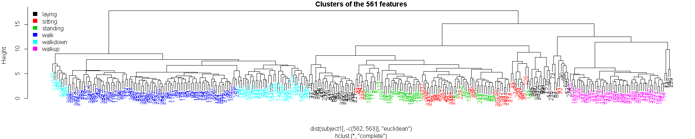
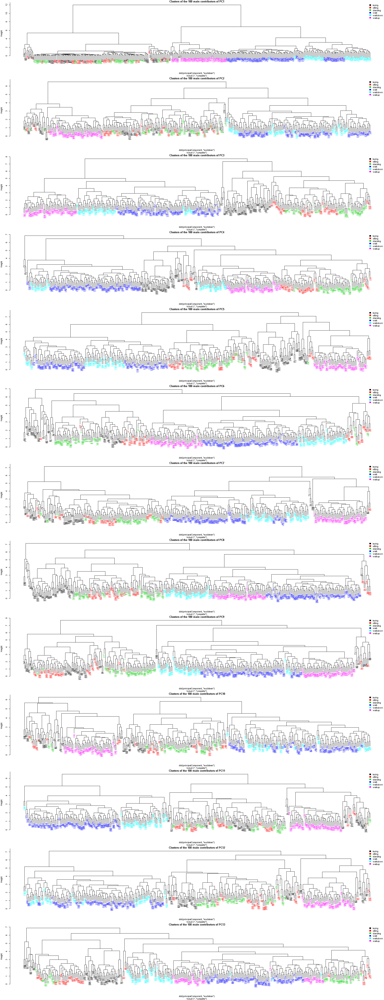

HAR-ADL-clustering
================
Maurício Collaça
Dec 8th, 2017

Summary
-------

The goal is to demonstrate a cluster analysis of the Human Activity Recognition database (HAR) built from the recordings of 30 subjects performing 6 activities of daily living (ADL) while carrying a waist-mounted smartphone with embedded inertial sensors.

The HAR Dataset is from the UCI's Center for Machine Learning and Intelligent Systems, available [here](http://archive.ics.uci.edu/ml/datasets/Human+Activity+Recognition+Using+Smartphones).

The experiments have been video-recorded to label the data manually. The obtained dataset has been randomly partitioned into two sets, where 70% of the volunteers was selected for generating the training data and 30% the test data. This data is supposed to train machines to recognize activity collected from the accelerometers and gyroscopes built into the smartphones that the subjects had strapped to their waists.

Exploratory Data Analysis
-------------------------

``` r
dim(train)
```

    ## [1] 7352  563

The training data set has 7352 observations each of 563 variables.

### Contingency tables

The last 2 columns contain subject and activity information.

``` r
names(train[,562:563])
```

    ## [1] "subject"  "activity"

Counting sensor statistics (rows) per subject:

    ## subjects
    ##   1   3   5   6   7   8  11  14  15  16  17  19  21  22  23  25  26  27 
    ## 347 341 302 325 308 281 316 323 328 366 368 360 408 321 372 409 392 376 
    ##  28  29  30 
    ## 382 344 383

Counting sensor statistics (rows) by Activities.

    ## activities
    ##   laying  sitting standing     walk walkdown   walkup 
    ##     1407     1286     1374     1226      986     1073

We have 6 activities, 3 passive (laying, standing and sitting) and 3 active which involve walking.

### Hypothesis questions

**Is the correlation between the measurements and activities good enough to train a machine?**

**Given a set of 561 measurements, would a trained machine be able to determine which of the 6 activities the person was doing?**

### Activity clusters of the first subject using all features



### Principal Component Analysis (PCA) from Singular Value Decomposition (SVD)

Variance Explained for the first subject: 

Number of features by proportions of Variance Explained

    ##      [,1] [,2] [,3] [,4] [,5] [,6]
    ## [1,] 0.8  0.85 0.9  0.95 0.99 1   
    ## [2,] 13   22   37   64   128  347

**Scatter plot**

Features selected by 85% of the Variance Explained mostly due to average display resolutions about 1920 X 1024 pixels.:


**Activity clusters varying by percentages of the Variance Explained** 

### Visual analysis of sensor averages in XYZ directions from time and frequency domains from all subjects

Initial feature subset:

    ##  [1] "tBodyAcc.mean...X"      "tBodyAcc.mean...Y"     
    ##  [3] "tBodyAcc.mean...Z"      "tGravityAcc.mean...X"  
    ##  [5] "tGravityAcc.mean...Y"   "tGravityAcc.mean...Z"  
    ##  [7] "tBodyAccJerk.mean...X"  "tBodyAccJerk.mean...Y" 
    ##  [9] "tBodyAccJerk.mean...Z"  "tBodyGyro.mean...X"    
    ## [11] "tBodyGyro.mean...Y"     "tBodyGyro.mean...Z"    
    ## [13] "tBodyGyroJerk.mean...X" "tBodyGyroJerk.mean...Y"
    ## [15] "tBodyGyroJerk.mean...Z" "fBodyAcc.mean...X"     
    ## [17] "fBodyAcc.mean...Y"      "fBodyAcc.mean...Z"     
    ## [19] "fBodyAccJerk.mean...X"  "fBodyAccJerk.mean...Y" 
    ## [21] "fBodyAccJerk.mean...Z"  "fBodyGyro.mean...X"    
    ## [23] "fBodyGyro.mean...Y"     "fBodyGyro.mean...Z"

**Scatter plots** 

Revised features subset:

    ## [1] "tGravityAcc.mean...X"  "tGravityAcc.mean...Y"  "tGravityAcc.mean...Z" 
    ## [4] "fBodyAcc.mean...X"     "fBodyAcc.mean...Y"     "fBodyAcc.mean...Z"    
    ## [7] "fBodyAccJerk.mean...X" "fBodyAccJerk.mean...Y" "fBodyAccJerk.mean...Z"

**Activity clusters of the first subject using selected features** 

### k-means Clustering

With all features, 2 groups and 100 random starts k-means almost correctly classified between walking and non-walking activities.

    ##        
    ## cluster laying sitting standing walk walkdown walkup
    ##       1      5       0        0   95       49     53
    ##       2     45      47       53    0        0      0

With all features, 6 groups and 100 random starts k-means stabilizes and correctly classified walk and walkdown activities.

    ##        
    ## cluster laying sitting standing walk walkdown walkup
    ##       1      3       0        0    0        0     53
    ##       2     29       0        0    0        0      0
    ##       3     18      10        2    0        0      0
    ##       4      0      37       51    0        0      0
    ##       5      0       0        0   95        0      0
    ##       6      0       0        0    0       49      0

    ##        
    ## cluster walk walkdown
    ##       5   95        0
    ##       6    0       49

With the Principal Components of SVD, 6 groups and 100 random starts k-means also stabilizes and correctly classified walk and walkdown activities.

    ##        
    ## cluster laying sitting standing walk walkdown walkup
    ##       1      2       0        0    0        0     53
    ##       2     29       0        0    0        0      0
    ##       3     19       9        2    0        0      0
    ##       4      0       0        0    0       49      0
    ##       5      0       0        0   95        0      0
    ##       6      0      38       51    0        0      0

    ##        
    ## cluster walk walkdown
    ##       4    0       49
    ##       5   95        0

Looking at the features (columns) of these centers to see if any dominate.


